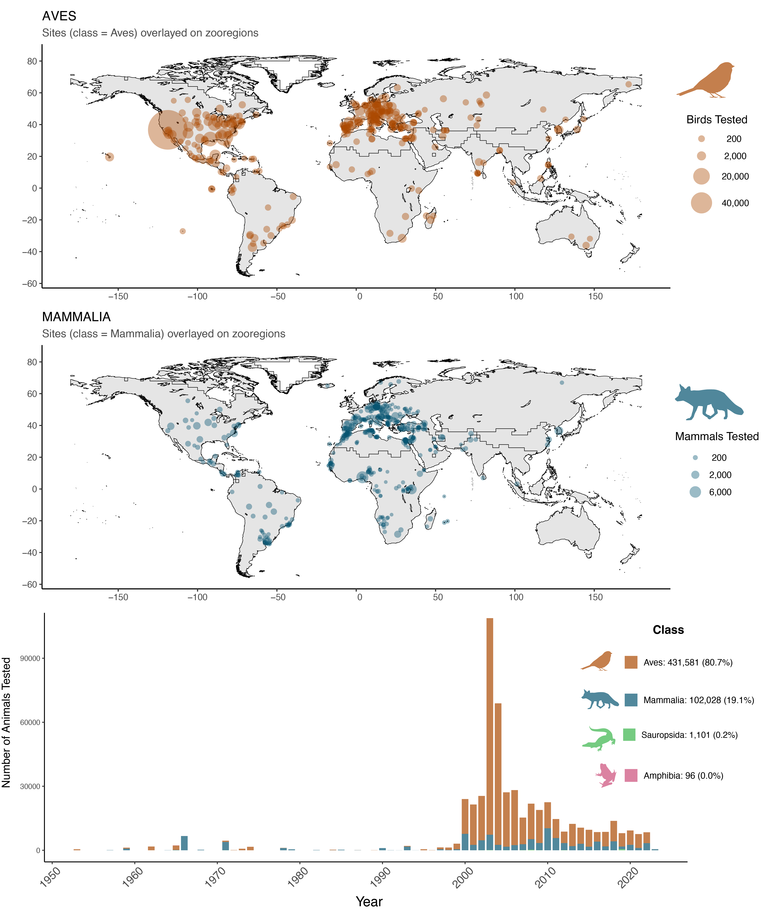

# WNV_host_competence_-_host_range
This repository includes two datasets: (1) experimental infection data with viremia curves and host competence estimates, and (2) field surveillance records of WNV infection in wild vertebrates. Designed for use in disease ecology and One Health research. Each folder contains a structured database provided in XLSX format, each one organized into four distinct spreadsheets:

## 1. WNV Host Competence Database
- **Observations**: Raw experimental infection data (viral titers, days post-infection, sample sizes).
- **Metadata**: Definitions of variables used in the datasets.
- **References**: Full citations of all experimental studies and doi to the original papers.
- **Taxonomy**: Bird taxonomy has been harmonized using AVONET and the Tobias et al. (2022) crosswalk (BirdLife, eBird, BirdTree), with additional checks in Avibase. Mammals (and other non-avian hosts such as Amphibia and Squamata) were standardized using the Mammal Diversity Database and the GBIF Backbone Taxonomy, retrieving accepted names and GBIF taxon IDs.

## 2. WNV Host Susceptibility Database
- **Observations**: Field records of WNV infection in free-ranging animals. Includes species, year, location, diagnostic method (PCR, virus isolation, serology), and prevalence estimates.
- **Metadata**: Definitions of variables used in the datasets.
- **References**: Full citations of all experimental studies and doi to the original papers
- **Taxonomy**: Given the dynamic nature of bird taxonomy, avian host classifications follow an integrative approach aligned with the AVONET dataset, incorporating multiple taxonomic treatments to facilitate compatibility with ecological trait databases, phylogenetic analyses, GBIF, and eBird abundance maps. Specifically, the taxonomic crosswalk framework of Tobias et al.(2022) was applied, integrating BirdLife International, eBird, and BirdTree, with additional verification and updates performed via Avibase. Mammalian hosts were standardized using the Mammal Diversity Database and the GBIF Backbone Taxonomy, thus ensuring precision by retrieving accepted scientific names along with their corresponding taxon IDs from the GBIF. Same for Amphibia and Squamata species included in the literature review.

## Citation

If you use this dataset, please cite the associated publication:

> [Insert full citation when available]

and cite the Zenodo repository entry <a href="https://doi.org/10.5281/zenodo.18032473" target="_blank" rel="noopener noreferrer"> https://doi.org/10.5281/zenodo.18032473, including the specific version of the data set used. Importantly, referencing the dataset does not replace the obligation to cite the original studies when they are used individually or a subset (i.e., a few constituent studies); these are fully documented in the dataset’s References and should be cited to acknowledge the primary data generators where appropriate.

## Contact

For questions or collaboration inquiries, please contact Alex Richter-Boix at [alex.richter@ceab.csic.es].
Our goal is to regularly maintain and expand the database. This will be achieved through systematic reviews of the literature and direct contributions from the research community. We encourage researchers to report any updates or corrections to the corresponding author to ensure accuracy and ongoing data improvement.

## License

This project is licensed under the [Creative Commons Attribution 4.0 International License (CC BY 4.0)](https://creativecommons.org/licenses/by/4.0/).

## Acknowledgements

This work is part of the [E4Warning project](https://www.e4warning.eu), funded by the European Union’s Horizon Europe programme (HORIZON Research and Innovation Actions) under Grant Agreement No. **101086640**, and the [VEO project](https://www.veo-europe.eu) (Versatile Emerging infectious disease Observatory), funded under the EU Horizon 2020 programme (Grant Agreement No. **874735**). We gratefully acknowledge Dr. Hiroaki Shirafuji and Dr. Fátima Cardozo, who kindly shared their data, contributing to the databases.
