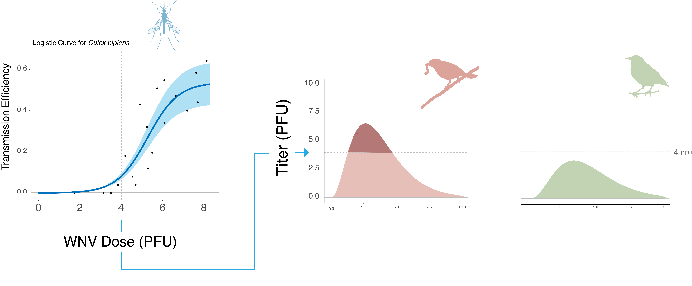

# WNV_host_competence_-_host_range
This repository includes two datasets: (1) experimental infection data with viremia curves and host competence estimates, and (2) field surveillance records of WNV infection in wild vertebrates. Designed for use in disease ecology and One Health research. Each folder contains a structured database provided in XLSX format, each one organized into four distinct spreadsheets:

## 1. WNV Host Competence Database
- **Observations**: Raw experimental infection data (viral titers, days post-infection, sample sizes).
- **Viremia Curve Characteristics**: Species-level parameters estimating magnitude and duration of infectiousness.
- **Metadata**: Definitions of variables used in the datasets.
- **References**: Full citations of all experimental studies and doi to the original papers.

## 2. WNV Host Susceptibility Database
- **Observations**: Field records of WNV infection in free-ranging animals. Includes species, year, location, diagnostic method (PCR, virus isolation, serology), and prevalence estimates.
- **Metadata**: Definitions of variables used in the datasets.
- **References**: Full citations of all experimental studies and doi to the original papers
- **Taxonomy**: Given the dynamic nature of bird taxonomy, avian host classifications follow an integrative approach aligned with the AVONET dataset, incorporating multiple taxonomic treatments to facilitate compatibility with ecological trait databases, phylogenetic analyses, GBIF, and eBird abundance maps. Specifically, the taxonomic crosswalk framework of Tobias et al.(2022) was applied, integrating BirdLife International, eBird, and BirdTree, with additional verification and updates performed via Avibase. Mammalian hosts were standardized using the Mammal Diversity Database and the GBIF Backbone Taxonomy, thus ensuring precision by retrieving accepted scientific names along with their corresponding taxon IDs from the GBIF. Same for Amphibia and Squamata species included in the literature review.

## 3. WNV Host Competence Calculation Script

The `WNV_Host_Competence` folder contains an R script used to estimate host-level parameters from viremia curves based on a systematic review of experimental infection studies. These scripts compute key viral dynamics and transmission efficiency metrics for each host species.

### Estimated Parameters
- **`a1`** – Magnitude parameter of the Wood equation  
- **`b1`** – Initial rate to peak viremia  
- **`c1`** – Decline rate after peak  
- **`Tmax`** – Time to maximal decay  
- **`Vmax`** – Maximal decay rate (indicator of immune response efficiency)  
- **`peak_titer`** – Peak viremia  
- **`peak_day`** – Time to peak viremia  
- **`duration_viremia`** – Days with viremia above the treshold log₁₀⁴ PFU/ml  
- **`start_day` / `end_day`** – First and last day above threshold  
- **`viral_load`** – Area under the viremia curve  
- **`auc_viremia`** – Area above the threshold of log₁₀⁴ PFU/ml  

### Transmission Efficiency Metrics
- **`sum_transmission_efficiency`** – Probability of infecting *Culex pipiens*, based on viral load above threshold  
- **`transmission_efficiency_mortality_corrected`** – Same as above, adjusted by daily host survival to reflect exposure likelihood

### Summary Statistics by Species
- **`n_curves`** – Number of infection curves analyzed  
- **`individuals_tested`** – Total individuals tested per species  
- **`mean_survival_ratio` / `se_survival_ratio`** – Mean and SE of final survival  
- **`mean_daily_survival` / `se_daily_survival`** – Mean and SE of daily survival across the infection period  

The script also supports exploratory plots of viremia dynamics and survival trajectories across species.

## Citation

If you use this dataset, please cite the associated publication:

> [Insert full citation when available]

and cite the Zenodo repository entry, including the specific version of the data set used. Importantly, referencing these datasets does not replace the obligation to cite the original studies, which are fully documented within the datasets (References) that generated the primary data when necessary.

## Contact

For questions or collaboration inquiries, please contact Alex Richter-Boix at [alex.richter@ceab.csic.es].

## License

This project is licensed under the [Creative Commons Attribution 4.0 International License (CC BY 4.0)](https://creativecommons.org/licenses/by/4.0/).
